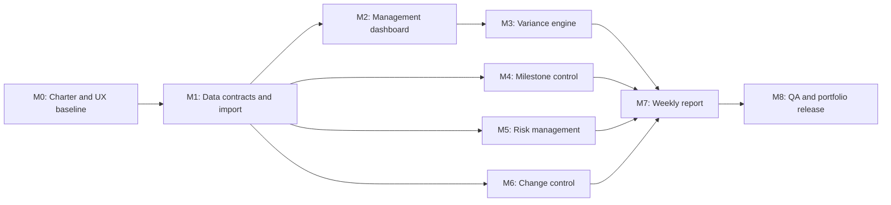

# Project Controls Dashboard — Delivery Roadmap

> **Superseded planning baseline:** This early roadmap remains for history. The
> authoritative delivery baseline is
> `/Users/wjl/Desktop/Project_Controls_Dashboard_Master_Plan.md` Version 1.1,
> dated 18 July 2026, with 94 estimated hours and a 25 September 2026 release
> target. See [`IMPLEMENTATION_STATUS.md`](IMPLEMENTATION_STATUS.md) for current
> evidence. Where dates or acceptance rules differ, the Version 1.1 master plan
> governs.

## Product objective

Build a portfolio-grade project-controls application that turns synthetic engineering schedule and cost data into clear management decisions. The application must show where a project is ahead or behind plan, explain cost and schedule variance, track delivery risks and controlled changes, and generate a concise weekly management report.

## Target users

- Graduate or assistant project manager preparing a weekly review.
- Project controls engineer checking schedule and cost performance.
- Engineering manager reviewing milestones, risks, changes, and actions.

## MVP boundary

The first release is a single-user, local-first web application. It imports CSV files, includes a complete demonstration dataset, and stores working data in the browser. Authentication, live enterprise-system integrations, collaboration, and a production cloud backend are deliberately deferred until after the portfolio release.

## Success targets for the finished MVP

- Import valid schedule and cost CSVs and explain invalid rows without losing the valid data.
- Load a realistic synthetic demonstration project containing at least 60 activities, 5 work packages, 16 weekly reporting periods, 8 milestones, 12 risks, and 6 change requests.
- Compare baseline, current forecast, and actual performance at project and work-package level.
- Calculate PV, EV, AC, SV, CV, SPI, CPI, BAC, and EAC correctly against fixed test fixtures.
- Track milestone status, risk exposure, risk treatment, change approval, and implementation status.
- Generate a weekly report containing an executive summary, KPI snapshot, milestone exceptions, top risks, change summary, and next actions.
- Pass automated calculation, import-validation, and core user-flow tests.
- Be understandable to a recruiter in a three-minute demonstration.

## Delivery assumptions

- Start date: 18 July 2026.
- Target portfolio release: 28 August 2026.
- Capacity assumption: approximately 10–12 focused hours per week.
- Target dates may move if necessary; acceptance criteria do not move without a recorded scope decision.
- All project and commercial data will be synthetic. No HS2, employer, client, or other confidential data will be used.

## Dependency map

The critical path is M0 → M1 → M2 → M3 → M7 → M8. Milestones M4–M6 can be developed independently after the shared data contracts in M1 are stable.

## Milestones and measurable targets

### M0 — Product charter and UX baseline

**Target date:** 19 July 2026  
**Objective:** Freeze the first-release problem, terminology, page structure, and calculation rules before implementation.

**Deliverables**

- Product charter with target users, problem statement, scope, and exclusions.
- Data dictionary covering activities, cost periods, milestones, risks, and changes.
- Low-fidelity layouts for Overview, Schedule & Cost, Milestones, Risks, Changes, and Weekly Report.
- Agreed status thresholds and colour rules.
- Initial technical architecture and testing strategy.

**Exit targets**

- Every requested feature has a named page and an owner data object.
- PV, EV, AC, SV, CV, SPI, CPI, BAC, and EAC definitions are written unambiguously.
- No confidential or employer data is required by the design.
- Out-of-scope features are explicit enough to prevent accidental expansion.

### M1 — Synthetic data contracts and resilient import

**Target date:** 24 July 2026  
**Depends on:** M0  
**Objective:** Establish trustworthy inputs for all later calculations and visualisations.

**Deliverables**

- Versioned CSV templates for schedule and weekly cost/progress data.
- Synthetic demonstration dataset with:
  - at least 60 activities across 5 work packages;
  - a 16-week baseline and reporting history;
  - baseline/current dates, dependencies, budget, actual cost, and physical progress;
  - 8 milestones, 12 risks, and 6 changes.
- Drag-and-drop/file-picker import flow.
- Row-level schema validation with actionable error messages.
- Data-preview and import-summary screens.

**Exit targets**

- The demonstration dataset imports with zero validation errors.
- A deliberately damaged fixture reports every invalid row and field.
- Duplicate IDs, invalid dates, negative costs, percentages outside 0–100, and missing required fields are rejected or clearly quarantined.
- Importing 1,000 activity rows completes in under two seconds on the development machine.

### M2 — Baseline-versus-actual management dashboard

**Target date:** 30 July 2026  
**Depends on:** M1  
**Objective:** Make overall project health understandable at a glance.

**Deliverables**

- Reporting-date selector and global work-package filter.
- KPI cards for planned progress, actual progress, budget, actual cost, forecast finish, and forecast final cost.
- Planned-versus-actual progress curve.
- Planned-versus-actual cost curve.
- Work-package performance table with exception highlighting.
- Clear empty, loading, invalid-data, and no-results states.

**Exit targets**

- A user can identify whether the project is late and/or over budget within 30 seconds.
- Every chart value can be traced back to imported rows.
- Filters update all dashboard components consistently.
- No chart uses misleading axes, truncated labels, or unexplained colours.
- Desktop and mobile layouts have no clipping or horizontal overflow.

### M3 — Schedule and cost variance engine

**Target date:** 4 August 2026  
**Depends on:** M2  
**Objective:** Convert progress and cost data into defensible project-control metrics.

**Calculation rules**

- Planned Value: `PV`.
- Earned Value: `EV`.
- Actual Cost: `AC`.
- Schedule Variance: `SV = EV - PV`.
- Cost Variance: `CV = EV - AC`.
- Schedule Performance Index: `SPI = EV / PV`.
- Cost Performance Index: `CPI = EV / AC`.
- Budget at Completion: `BAC`.
- Estimate at Completion: `EAC = BAC / CPI` for the MVP forecasting assumption.

**Deliverables**

- Pure calculation library separated from presentation code.
- Project and work-package variance breakdowns.
- Traffic-light thresholds with a written rationale.
- Tooltip/help content explaining every metric in plain language.
- Unit-test fixtures for normal, zero-denominator, missing-period, and boundary cases.

**Exit targets**

- All agreed calculation fixtures return their hand-calculated expected results.
- Division by zero and missing data produce an explicit “not available” state, never `Infinity` or `NaN`.
- Rounding occurs only for display; underlying calculations retain precision.
- A reviewer can reproduce any headline metric from the source fixture.

### M4 — Milestone control

**Target date:** 7 August 2026  
**Depends on:** M1  
**Objective:** Highlight time-critical commitments and emerging slippage.

**Deliverables**

- Milestone register with owner, baseline date, forecast date, actual date, dependency, and commentary.
- Automatic status: complete, on track, at risk, or late.
- Variance in calendar days.
- Filter for overdue and next-30-day milestones.
- Milestone exception summary for the dashboard and weekly report.

**Exit targets**

- Status is calculated consistently from reporting date and milestone dates.
- Every late or at-risk milestone has an owner and commentary field.
- Changing the reporting date updates milestone status correctly.
- Completed milestones retain their baseline and actual dates for auditability.

### M5 — Risk register and heatmap

**Target date:** 12 August 2026  
**Depends on:** M1  
**Objective:** Turn delivery uncertainty into prioritised management action.

**Deliverables**

- Risk register with cause, event, effect, owner, probability, impact, treatment, due date, status, and review date.
- Five-by-five probability/impact heatmap.
- Inherent and residual risk scores.
- Filters by owner, status, category, and exposure.
- Top-risk panel showing treatment progress and overdue actions.

**Exit targets**

- Every open high risk has an owner, treatment, and target date.
- Heatmap counts always match the filtered register.
- Moving a risk between probability/impact values updates all summaries immediately.
- Residual risk cannot be entered without a treatment description.
- Risk scoring and colour thresholds are documented and tested at boundaries.

### M6 — Controlled change register

**Target date:** 17 August 2026  
**Depends on:** M1  
**Objective:** Demonstrate disciplined scope, cost, and schedule change control.

**Deliverables**

- Change request form with reason, requester, affected work package, cost impact, schedule impact, risk impact, decision, approver, and dates.
- Status workflow: draft → submitted → approved/rejected → implemented.
- Change log and decision history.
- Summary of pending and approved cost/schedule impacts.
- Revised-baseline concept that preserves the original baseline.

**Exit targets**

- Only approved changes can affect the current approved forecast/baseline view.
- Original baseline values remain immutable and visible.
- Every decision records approver, date, and rationale.
- Invalid status transitions are blocked.
- Change totals reconcile exactly with individual approved changes.

### M7 — Weekly management report

**Target date:** 22 August 2026  
**Depends on:** M3, M4, M5, M6  
**Objective:** Produce a decision-focused report from the current reporting snapshot.

**Deliverables**

- Report-period and work-package selection.
- Editable executive summary with data-backed suggested exceptions.
- KPI snapshot covering progress, cost, schedule, SPI, CPI, and forecast.
- Milestone exceptions, top risks, pending/approved changes, and next actions.
- Printable layout and PDF export.
- Visible report timestamp, reporting date, data-version reference, and assumptions.

**Exit targets**

- Report figures match the dashboard for the same reporting date and filters.
- The generated report fits a concise two-to-four-page management format.
- No section silently disappears; empty sections state that no exceptions exist.
- The PDF contains no clipping, overlapping text, broken charts, or blank trailing pages.
- A user can generate the report in fewer than five interactions after data is loaded.

### M8 — Quality gate and portfolio release

**Target date:** 28 August 2026  
**Depends on:** M7 and completion of all earlier exit targets  
**Objective:** Turn the MVP into credible portfolio evidence rather than an unfinished prototype.

**Deliverables**

- Automated unit, import-validation, and critical-flow tests.
- Accessibility and responsive-layout review.
- Security/privacy check confirming that imported data stays local in the MVP.
- README with screenshots, architecture diagram, calculation definitions, setup steps, limitations, and roadmap.
- Seeded one-click demonstration mode.
- Deployed demo or packaged release.
- Three-minute walkthrough video.
- Short project retrospective covering scope decisions, risks, trade-offs, results, and next steps.
- Feedback from at least five testers.

**Exit targets**

- Zero unresolved release-blocking defects.
- All calculation and import-validation tests pass.
- Core flows work at desktop and 390-pixel mobile widths.
- Five testers can complete import → review → report without assistance; at least four succeed on their first attempt.
- README allows a new user to run the project without private instructions.
- The project can be explained in a graduate interview using a clear problem/action/result narrative.

## Stage-gate scorecard

At the end of each milestone, record:

- Scope delivered: target 100% of the milestone acceptance criteria.
- Automated checks: target 100% passing.
- Release-blocking defects: target 0 before closing the milestone.
- Deferred items: named, justified, and moved to a later milestone or backlog.
- Decision log: architecture, calculation, threshold, or scope decisions updated.
- Demo evidence: screenshot, fixture, test result, or short recording showing completion.

## Phase 2 backlog — explicitly outside the MVP

- User accounts, roles, permissions, and cloud sync.
- Multi-user comments, approvals, and notifications.
- Primavera P6, Microsoft Project, Excel, or enterprise cost-system connectors.
- Monte Carlo schedule/cost risk analysis.
- Resource loading and resource levelling.
- AI-generated narrative without human review.
- Live use with employer, client, or commercially sensitive data.

## Immediate next action

Complete M0 by creating the product charter, data dictionary, calculation specification, technical architecture, and low-fidelity page layouts. Do not start dashboard implementation until those shared contracts are stable.
